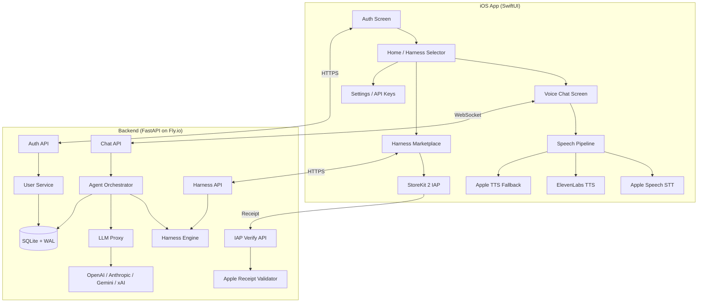
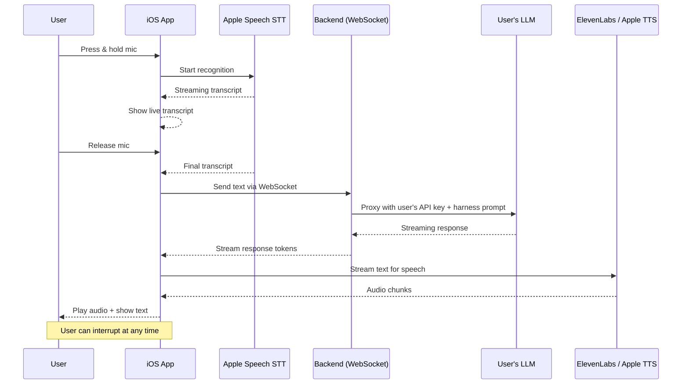

# Agent — Your Personal AI Harness

A voice-first iOS app where users bring their own LLM API keys and use swappable "Harnesses" (pre-built agent configurations). Default harness is free; premium harnesses sold via IAP.

## Decisions (Confirmed)

| Decision | Choice | Notes |
|----------|--------|-------|
| **Hosting** | **Fly.io** | Free tier (3 shared VMs) → $7/mo shared-cpu-2x at hundreds of users → scale horizontally at thousands. Pay-per-use, machines auto-stop when idle. Best scale-to-cost ratio. |
| **IAP** | **StoreKit 2 native** | No third-party SDK. Zero ongoing cost. |
| **STT** | **Apple Speech** (`SFSpeechRecognizer`) | Free, on-device, private. Architecture allows Deepgram swap-in later if needed. |
| **TTS** | **ElevenLabs** (primary) + **Apple TTS** (fallback) | Premium voice quality with free on-device fallback. |

> [!NOTE]
> **Scaling path**: Fly.io free tier → single shared-cpu-2x (~$7/mo, handles ~500 concurrent WS connections) → add machines horizontally (~$15-30/mo for thousands). SQLite → PostgreSQL migration only if/when multi-region is needed.

---

## Architecture Overview



---

## Tech Decisions

| Layer | Choice | Rationale |
|-------|--------|-----------|
| iOS UI | SwiftUI, iOS 17+ | Modern declarative, required for latest APIs |
| iOS Architecture | MVVM + `@Observable` | Simpler than TCA, native Swift concurrency |
| Auth | Apple Sign In + email (via backend JWT) | Apple-native, fast onboarding |
| Keychain | Custom `KeychainManager` wrapper | Secure API key storage on-device |
| IAP | StoreKit 2 (native) | No third-party dependency, server-side verification |
| STT | `SFSpeechRecognizer` (on-device) | Free, private, zero-cost baseline |
| TTS | ElevenLabs streaming (primary), `AVSpeechSynthesizer` (fallback) | Premium voice quality, free fallback |
| Backend | Python 3.12 + FastAPI + uvicorn | Async, fast, lightweight |
| Agent Orchestration | LangGraph (stateful agent graphs) | Built-in state management, tool calling |
| Database | SQLite (WAL mode) via `aiosqlite` | Zero-cost, single-file, perfect for single VPS |
| Hosting | Fly.io (or Hetzner VPS) | Near-zero cost, easy deploy |
| Auth tokens | JWT (PyJWT) | Stateless, lightweight |

---

## Proposed Changes

### iOS Project Structure

#### [NEW] `Agent/` Xcode project root

```
Agent/
├── Agent.xcodeproj/
├── Agent/
│   ├── AgentApp.swift                      # App entry point
│   ├── Info.plist
│   ├── Assets.xcassets/
│   │
│   ├── Core/
│   │   ├── Design/
│   │   │   ├── Theme.swift                 # Colors, fonts, spacing
│   │   │   ├── Components/
│   │   │   │   ├── PulsingMicButton.swift  # Animated mic button
│   │   │   │   ├── WaveformView.swift      # Audio waveform animation
│   │   │   │   ├── HarnessAvatar.swift     # Harness icon/avatar
│   │   │   │   └── GlassCard.swift         # Glassmorphism card
│   │   ├── Keychain/
│   │   │   └── KeychainManager.swift       # Secure key storage
│   │   ├── Network/
│   │   │   ├── APIClient.swift             # HTTP + WebSocket client
│   │   │   └── Endpoints.swift             # API endpoint definitions
│   │   └── Models/
│   │       ├── User.swift
│   │       ├── Harness.swift
│   │       ├── Message.swift
│   │       └── LLMProvider.swift
│   │
│   ├── Features/
│   │   ├── Auth/
│   │   │   ├── AuthView.swift              # Sign in screen
│   │   │   ├── AuthViewModel.swift
│   │   │   └── AppleSignInManager.swift
│   │   ├── Home/
│   │   │   ├── HomeView.swift              # Main home screen
│   │   │   └── HomeViewModel.swift
│   │   ├── Chat/
│   │   │   ├── ChatView.swift              # Voice + text chat
│   │   │   ├── ChatViewModel.swift
│   │   │   └── MessageBubble.swift
│   │   ├── Voice/
│   │   │   ├── VoicePipeline.swift         # STT + TTS coordination
│   │   │   ├── SpeechRecognizer.swift      # Apple Speech STT
│   │   │   ├── ElevenLabsTTS.swift         # ElevenLabs streaming
│   │   │   └── AppleTTS.swift              # AVSpeechSynthesizer fallback
│   │   ├── Marketplace/
│   │   │   ├── MarketplaceView.swift       # Browse harnesses
│   │   │   ├── MarketplaceViewModel.swift
│   │   │   ├── HarnessDetailView.swift
│   │   │   └── StoreKitManager.swift       # IAP logic
│   │   └── Settings/
│   │       ├── SettingsView.swift           # API key mgmt + preferences
│   │       └── APIKeyEntryView.swift
│   │
│   └── Navigation/
│       └── AppRouter.swift                 # Root navigation coordinator
```

---

### Backend Project Structure

#### [NEW] `agent-backend/`

```
agent-backend/
├── pyproject.toml
├── Dockerfile
├── fly.toml
├── alembic/                               # DB migrations
├── app/
│   ├── main.py                            # FastAPI app entry
│   ├── config.py                          # Settings + env vars
│   ├── database.py                        # SQLite connection + init
│   ├── auth/
│   │   ├── router.py                      # /auth endpoints
│   │   ├── service.py                     # JWT + Apple ID verification
│   │   └── models.py
│   ├── chat/
│   │   ├── router.py                      # /chat WebSocket endpoint
│   │   ├── orchestrator.py                # LangGraph agent runner
│   │   └── llm_proxy.py                   # Routes calls to user's LLM
│   ├── harnesses/
│   │   ├── router.py                      # /harnesses CRUD
│   │   ├── service.py
│   │   ├── definitions/                   # YAML harness definitions
│   │   │   ├── default.yaml
│   │   │   ├── startup_founder.yaml
│   │   │   └── musician_helper.yaml
│   │   └── models.py
│   ├── iap/
│   │   ├── router.py                      # /iap/verify endpoint
│   │   └── apple_receipt.py               # Server-side receipt validation
│   └── users/
│       ├── router.py
│       ├── service.py
│       └── models.py
```

---

### Database Schema (SQLite)

```sql
-- Users
CREATE TABLE users (
    id TEXT PRIMARY KEY,           -- UUID
    apple_id TEXT UNIQUE,
    email TEXT UNIQUE,
    display_name TEXT,
    active_harness_id TEXT DEFAULT 'default',
    tier TEXT DEFAULT 'free',      -- free | premium | pro
    created_at TIMESTAMP DEFAULT CURRENT_TIMESTAMP
);

-- User purchases
CREATE TABLE purchases (
    id TEXT PRIMARY KEY,
    user_id TEXT REFERENCES users(id),
    product_id TEXT NOT NULL,      -- StoreKit product ID
    transaction_id TEXT UNIQUE,
    purchased_at TIMESTAMP DEFAULT CURRENT_TIMESTAMP
);

-- Harness definitions (seeded, not user-editable)
CREATE TABLE harnesses (
    id TEXT PRIMARY KEY,
    name TEXT NOT NULL,
    description TEXT,
    icon_name TEXT,
    system_prompt TEXT NOT NULL,
    tools_config JSON,             -- Tool definitions
    is_free BOOLEAN DEFAULT FALSE,
    price_product_id TEXT,         -- StoreKit product ID
    category TEXT
);

-- Chat sessions (per user, per harness)
CREATE TABLE sessions (
    id TEXT PRIMARY KEY,
    user_id TEXT REFERENCES users(id),
    harness_id TEXT REFERENCES harnesses(id),
    messages JSON DEFAULT '[]',
    state JSON DEFAULT '{}',       -- Agent state (LangGraph checkpoints)
    created_at TIMESTAMP DEFAULT CURRENT_TIMESTAMP,
    updated_at TIMESTAMP DEFAULT CURRENT_TIMESTAMP
);
```

---

### Voice Pipeline Design



**Interrupt handling**: When user presses mic during TTS playback, immediately stop audio playback, cancel TTS, and begin new STT recognition.

---

### Multi-Tenancy Strategy

- **Session isolation**: Each user gets isolated chat sessions with their own state. No shared mutable state between users.
- **API key passthrough**: iOS sends the user's encrypted API key per-request (or per WebSocket session). Backend uses it for that request only — never persists it.
- **Lightweight**: No Docker containers per user. Just database-isolated sessions with per-user state in the `sessions` table.
- **Harness hot-swap**: Changing harness just updates `users.active_harness_id` and loads the new system prompt + tools config. Existing session state is preserved per harness.

---

## Phased Delivery Plan

### Phase 1 — iOS Skeleton (This session)
Build the complete SwiftUI project: app entry, navigation, auth screens, voice chat UI with waveform animations, harness marketplace, settings/API key entry, and keychain management.

### Phase 2 — Backend Core
FastAPI project with auth, chat WebSocket, LLM proxy, harness definitions.

### Phase 3 — Integration
Wire iOS ↔ backend, implement real voice pipeline, IAP verification.

### Phase 4 — Polish
Animations, error states, offline mode, and final UX tuning.

---

## Verification Plan

### Automated Tests
- **iOS**: Xcode scheme with XCTest. Run via `xcodebuild test -scheme Agent -destination 'platform=iOS Simulator,name=iPhone 16'`
- **Backend**: `pytest` suite. Run via `cd agent-backend && pytest -v`

### Manual Verification
1. **iOS build**: Open `Agent.xcodeproj` in Xcode → build for iPhone 16 simulator → verify all screens render correctly
2. **Voice chat UI**: Tap and hold mic button → verify waveform animation plays → release → verify animation stops
3. **Auth flow**: Tap "Sign in with Apple" → verify Apple Sign In sheet appears
4. **Keychain**: Enter an API key → close and reopen app → verify key persists
5. **Harness marketplace**: Browse harnesses → tap one → verify detail view renders
6. **Backend**: Run `uvicorn app.main:app --reload` → test endpoints with `curl` or API client

> [!NOTE]
> Since this is a new project, there are no existing tests to reference. Tests will be created alongside the implementation in each phase.
